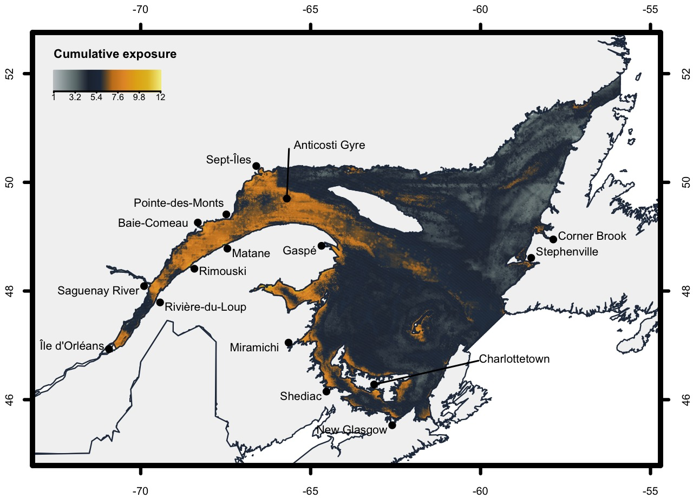
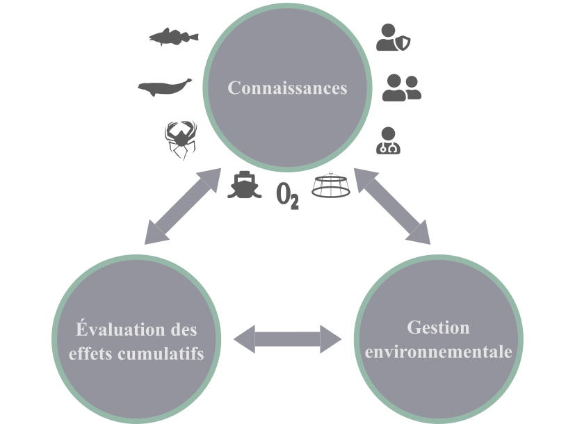

```{r setup, include=FALSE}
htmltools::tagList(rmarkdown::html_dependency_font_awesome())
cl <- '#68908b'
rfa <- function(...) icons::fontawesome(...)
gh <- function() icons::icon_style(rfa("github"), fill = cl)
rp <- function() icons::icon_style(rfa("r-project"), fill = cl)
db <- function() icons::icon_style(rfa("database"), fill = cl)
mp <- function() icons::icon_style(rfa("globe-americas"), fill = cl)
en <- function() icons::icon_style(rfa("envelope"), fill = cl)


```

class: title-slide, middle


# Les stresseurs environnementaux du Système du Saint-Laurent


<center></img></center>


#### **Characterizing exposure to and sharing knowledge of drivers of environmental change in the st. Lawrence system in canada**

#### Beauchesne D, Daigle R, Vissault S, Gravel D, Bastien A, Bélanger S, Bernatchez P, Blais M, Bourdages H, Chion C, Galbraith P, Halpern B, Lavoie C, McKindsey C, Mucci A, Pineault S, Starr M, Ste-Marie A, Archambault P

<br>

#### Webinaire Québec Océan

<span class="br2"></span>

#### 2021-06-08


<!-- =~-~=~-~=~-~=~-~=~-~=~-~=~-~=~-~=~-~=~-~=~-~=~-~=~-~=~-~=~-~=~-~=~-~= -->
<!-- =~-~=~-~=~-~=~-~=~-~=~-~=~-~=~-~=~-~=~-~=~-~=~-~=~-~=~-~=~-~=~-~=~-~= -->
<!-- =~-~=~-~=~-~=~-~=~-~=~-~=~-~=~-~=~-~=~-~=~-~=~-~=~-~=~-~=~-~=~-~=~-~= -->
<!-- Stresseurs environnementaux-->
<!-- =~-~=~-~=~-~=~-~=~-~=~-~=~-~=~-~=~-~=~-~=~-~=~-~=~-~=~-~=~-~=~-~=~-~= -->
<!-- =~-~=~-~=~-~=~-~=~-~=~-~=~-~=~-~=~-~=~-~=~-~=~-~=~-~=~-~=~-~=~-~=~-~= -->
<!-- =~-~=~-~=~-~=~-~=~-~=~-~=~-~=~-~=~-~=~-~=~-~=~-~=~-~=~-~=~-~=~-~=~-~= -->
---

class: inverse, center, middle

# Système du Saint-Laurent

<html><div style='float:left'></div><hr color='#ffdd55' style="margin-top:-30px" size=1px width=720px></html>

<h2 style="color:#ffdd55;"><b>Stresseurs environnementaux</b></h2>
<h2>Un processus collaboratif</h2>
<h2>Et maintenant?</h2>

---

# Système du Saint-Laurent

<span class="br2"></span>

.pull-left[
- Estuaire et golfe
- Communautés écologiques diversifiées et productives
- Continuum écologique avec le bassin des Grands Lacs
  - \> de 45 millions de Nord Américains
- Crucial à l'économie canadienne
]

.pull-right[
<center></img></center>
]

---

# Système du Saint-Laurent

## Stresseurs environnementaux

<span class="br2"></span>

<center></img></center>

.references[
  Duarte et al. 2014; Boonstra et al. 2015; FAO 2017; IPCC 2019
]

--

**Objectif**: Caractériser la distribution et l'intensité des stresseurs environnementaux dans le Système du Saint-Laurent

---

# Système du Saint-Laurent

## Stresseurs environnementaux

.pull-left[
- Climat (6)
- Terrestre (5)
- Pêcheries (5)
- Navigation (2)
]

.pull-right[
<center></img></center>
]

.references[
.font90[Halpern et al. 2015; DFO 2016; Statistics Canada 2017; Galbraith et al. 2018; Blais et al. 2019; Earth observation group 2019; Starr et Chassé 2019]
]


---

# Système du Saint-Laurent

## Exposition cumulée

<span class="br2"></span>

<center></img></center>

.references[Beauchesne et al. 2020]


---

# Système du Saint-Laurent

## Profils d'exposition cumulée

<span class="br2"></span>

<center></img></center>

.references[Beauchesne et al. 2020]

<!-- =~-~=~-~=~-~=~-~=~-~=~-~=~-~=~-~=~-~=~-~=~-~=~-~=~-~=~-~=~-~=~-~=~-~= -->
<!-- =~-~=~-~=~-~=~-~=~-~=~-~=~-~=~-~=~-~=~-~=~-~=~-~=~-~=~-~=~-~=~-~=~-~= -->
<!-- =~-~=~-~=~-~=~-~=~-~=~-~=~-~=~-~=~-~=~-~=~-~=~-~=~-~=~-~=~-~=~-~=~-~= -->
<!-- Processus  collaboratif -->
<!-- =~-~=~-~=~-~=~-~=~-~=~-~=~-~=~-~=~-~=~-~=~-~=~-~=~-~=~-~=~-~=~-~=~-~= -->
<!-- =~-~=~-~=~-~=~-~=~-~=~-~=~-~=~-~=~-~=~-~=~-~=~-~=~-~=~-~=~-~=~-~=~-~= -->
<!-- =~-~=~-~=~-~=~-~=~-~=~-~=~-~=~-~=~-~=~-~=~-~=~-~=~-~=~-~=~-~=~-~=~-~= -->
---

class: inverse, center, middle

# Système du Saint-Laurent

<html><div style='float:left'></div><hr color='#ffdd55' style="margin-top:-30px" size=1px width=720px></html>

<h2>Stresseurs environnementaux</h2>
<h2 style="color:#ffdd55;"><b>Un processus collaboratif</b></h2>
<h2>Et maintenant?</h2>


---

# Un processus collaboratif

<span class="br2"></span>

.pull-left[
## Experts

.font90[
- [`r en()`](mailto:david.beauchesne@hotmail.com) David Beauchesne
- [`r en()`](mailto:philippe.archambault@bio.ulaval.ca) Philippe Archambault
- [`r en()`](mailto:dominique.gravel@usherbrooke.ca) Dominique Gravel
- [`r en()`](mailto:BastienA@ogsl.ca) Andréane Bastien
- [`r en()`](mailto:simon_belanger@uqar.ca) Simon Bélanger
- [`r en()`](mailto:Pascal_Bernatchez@uqar.ca) Pascal Bernatchez
- [`r en()`](mailto:Hugo.Bourdages@dfo-mpo.gc.ca) Hugo Bourdages
- [`r en()`](mailto:clementchion@gmail.com) Clément Chion
- [`r en()`](mailto:daigleremi@gmail.com) Rémi M. Daigle
- [`r en()`](mailto:Peter.Galbraith@dfo-mpo.gc.ca) Peter S. Galbraith
- [`r en()`](mailto:halpern@nceas.ucsb.edu) Benjamin S. Halpern
- [`r en()`](mailto:Chris.Mckindsey@dfo-mpo.gc.ca) Christopher W. McKindsey
- [`r en()`](mailto:alfonso.mucci@mcgill.ca) Alfonso Mucci
- [`r en()`](mailto:Simon.Pineault@environnement.gouv.qc.ca) Simon Pineault
- [`r en()`](mailto:Michel.Starr@dfo-mpo.gc.ca) Michel Starr
- [`r en()`](mailto:SteMarieA@ogsl.ca) Anne-Sophie Ste-Marie
- [`r en()`](mailto:steve.vissault@usherbrooke.ca) Steve Vissault
]
]

.pull-right[
## Partenaires

<span class="br2"></span>

<div class="wrapper">
<div class="logo2">
<div id="benthos">
    
</div>
<div id="ogsl">
    
</div>
<div id="ielab">
    
</div>
</div>
</div>

<h7>Académique</h7>

<div class="wrapper">
<div class="logo">
<div id="ismer">
    
</div>
<div id="laval">
    
</div>
<div id="uds">
    
</div>
</div>
</div>

<h7>Gouvernemental</h7>

<div class="wrapper">
<div class="logo">
<div id="mpo">
    
</div>
<div id="melcc">
    
</div>
<div id="crsng">
    
</div>
<div id="fqrnt">
    
</div>
</div>
</div>

<h7>Regroupements de recherche</h7>

<div class="wrapper">
<div class="logo">
  <div id="takuvik">
      
  </div>
  <div id="chone">
      
  </div>
  <div id="qcocean">
      
  </div>
  <div id="notregolf">
      
  </div>
  <div id="csbq">
      
  </div>
  <div id="nceas">
      
  </div>
</div>
</div>

<h7>Privé</h7>

<div class="wrapper">
<div class="logo">
  <div id="inrest">
      
  </div>
  <div id="port7i">
      
  </div>
</div>
</div>

]
---

# Un processus collaboratif

## *eDrivers* &nbsp;&nbsp; [`r gh()`](https://github.com/eDrivers) [`r rp()`](https://github.com/eDrivers/eDrivers) [`r db()`](https://github.com/eDrivers/eDriversWorkflows) [`r mp()`](https://david-beauchesne.shinyapps.io/edriversapp/)

<span class="br2"></span>

<a href="https://david-beauchesne.shinyapps.io/edriversapp/">
  <center></img></center>
</a>


<!-- =~-~=~-~=~-~=~-~=~-~=~-~=~-~=~-~=~-~=~-~=~-~=~-~=~-~=~-~=~-~=~-~=~-~= -->
<!-- =~-~=~-~=~-~=~-~=~-~=~-~=~-~=~-~=~-~=~-~=~-~=~-~=~-~=~-~=~-~=~-~=~-~= -->
<!-- =~-~=~-~=~-~=~-~=~-~=~-~=~-~=~-~=~-~=~-~=~-~=~-~=~-~=~-~=~-~=~-~=~-~= -->
<!-- Et maintenant? -->
<!-- =~-~=~-~=~-~=~-~=~-~=~-~=~-~=~-~=~-~=~-~=~-~=~-~=~-~=~-~=~-~=~-~=~-~= -->
<!-- =~-~=~-~=~-~=~-~=~-~=~-~=~-~=~-~=~-~=~-~=~-~=~-~=~-~=~-~=~-~=~-~=~-~= -->
<!-- =~-~=~-~=~-~=~-~=~-~=~-~=~-~=~-~=~-~=~-~=~-~=~-~=~-~=~-~=~-~=~-~=~-~= -->
---

class: inverse, center, middle

# Système du Saint-Laurent

<html><div style='float:left'></div><hr color='#ffdd55' style="margin-top:-30px" size=1px width=720px></html>

<h2>Stresseurs environnementaux</h2>
<h2>Un processus collaboratif</h2>
<h2 style="color:#ffdd55;"><b>Et maintenant?</b></h2>

---

# Et maintenant?

.pull-left2[
- **Effets cumulatifs**
]

.pull-right2[
<br/>

<center></img></center>
]

.references[Beauchesne et al. en préparation]

---

# Et maintenant?

.pull-left2[
- **Effets cumulatifs**

- ***eDrivers*** **& OGSL**

]


.pull-right2[
<br/>
<center></img></center>
]

---

# Et maintenant?

.pull-left2[
- **Effets cumulatifs**

- ***eDrivers*** **& OGSL**

- **Zone Atlantique**
]

.pull-right2[
<center></img></center>
]


<!-- =~-~=~-~=~-~=~-~=~-~=~-~=~-~=~-~=~-~=~-~=~-~=~-~=~-~=~-~=~-~=~-~=~-~= -->
<!-- =~-~=~-~=~-~=~-~=~-~=~-~=~-~=~-~=~-~=~-~=~-~=~-~=~-~=~-~=~-~=~-~=~-~= -->
<!-- =~-~=~-~=~-~=~-~=~-~=~-~=~-~=~-~=~-~=~-~=~-~=~-~=~-~=~-~=~-~=~-~=~-~= -->
<!-- Thank you -->
<!-- =~-~=~-~=~-~=~-~=~-~=~-~=~-~=~-~=~-~=~-~=~-~=~-~=~-~=~-~=~-~=~-~=~-~= -->
<!-- =~-~=~-~=~-~=~-~=~-~=~-~=~-~=~-~=~-~=~-~=~-~=~-~=~-~=~-~=~-~=~-~=~-~= -->
<!-- =~-~=~-~=~-~=~-~=~-~=~-~=~-~=~-~=~-~=~-~=~-~=~-~=~-~=~-~=~-~=~-~=~-~= -->
---


class: inverse, center, middle

# Merci !

<html><div style='float:left'></div><hr color='#ffdd55' style="margin-top:-30px" size=1px width=720px></html>
